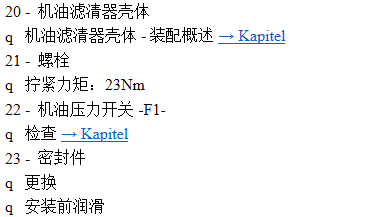
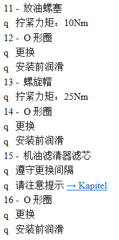

# 帕萨特v6

## 保养记录

### 接手前

### 公里数：73124；时间：2019年10月

- 更换了：机油、机滤、火花塞、空调滤芯（4s店）
- 更换了：皮带、轮胎、防冻液、变速箱油、前刹车片一对（黄河6路米其林修理店）

## 保养教程

### 更换后倒车灯

- 网上相关文章： [教你更换帕萨特倒车灯.pdf](file\教你更换帕萨特倒车灯.pdf) 

- 维修手册：

   [更换车身上的倒车灯灯泡-v6.pdf](file\更换车身上的倒车灯灯泡-v6.pdf) 

   [拆卸和安装车身上的尾灯-v6.pdf](file\拆卸和安装车身上的尾灯-v6.pdf) 

   [车身上的尾灯-v6.pdf](file\车身上的尾灯-v6.pdf) 

### 更换机油机滤

- 维修手册：

  

  

  

# 凯越1.6

## 保养记录

### 公里数：时间：2019年12月

- 变速箱油、变速箱滤网、转向油、机油机滤、冷却液、机脚垫、火花塞、空气滤

## 保养教程

### 换火花塞

- 型号参数：
- 周期：2万公里（来自维修说明书）
- 紧固规格：

参考视频：

<video src=".\file\换火花塞.mp4"></video>
### 换机油机滤

- 机滤位置（图中15为机滤）：
- 机油垫片直径：？
- 注意查看机油滤清器的密封圈有没有残留在车体上
- 机油型号：

参考视频：

<video src=".\file\换机油机滤.mp4"></video>
### 换防冻液

- 更换数量：
- 步骤：

参考视频：

<video src=".\file\换防冻液.mp4"></video>
### 换空气滤芯

- 更换周期：4万公里（来自维修手册）

- 步骤：

- 拆手套箱：

参考视频：

<video src=".\file\换空滤.mp4"></video>
### 换变速箱油

- 排放程序：

  

  

- 加注程序：

  

- 若更换储油盘和变速箱滤网：

  

  

  

参考视频：

<video src=".\file\换变速箱油.mp4"></video>
### 换气门室盖密封圈

- 气门室盖（凸轮轴罩）的卸载和安装：

- 网友更换实例： https://club.autohome.com.cn/bbs/thread/c9c25afa464ecace/52316239-1.html

参考视频：

<video src=".\file\换密封圈.mp4"></video>

### 更换B柱处车门饰板

 [自己动手更换车门外饰板.pdf](file\自己动手更换车门外饰板.pdf) 

# 奔驰C260

型号：

## 保养教程-维修手册

### 换机油机滤

 [更换机油机滤.pdf](file\更换机油机滤.pdf) 

补充文件： [AH18.00-P-0104-01A.pdf](file\AH18.00-P-0104-01A.pdf)  [AS18.00-Z-0001-01A.pdf](file\AS18.00-Z-0001-01A.pdf)  [AS00.00-Z-0005-01A.pdf](file\AS00.00-Z-0005-01A.pdf)  [AP18.00-P-1811MP.pdf](file\AP18.00-P-1811MP.pdf) 

### 换空滤

 [更换空滤.pdf](file\更换空滤.pdf) 

### 换火花塞

  [换火花塞.pdf](file\换火花塞.pdf) 

补充文件：  [AH15.10-P-0002-02A.pdf](file\AH15.10-P-0002-02A.pdf)  [AR15.12-P-2003-01P.pdf](file\AR15.12-P-2003-01P.pdf)  [AR15.12-P-2003CW.pdf](file\AR15.12-P-2003CW.pdf) 

## 论坛相关文章

 [奔驰C200通病-凸轮轴调节轮损坏故障.pdf](file\奔驰C200通病-凸轮轴调节轮损坏故障.pdf) 

 [奔驰C260更换变速箱油.pdf](file\奔驰C260更换变速箱油.pdf) 

 [奔驰Cw204换空滤.pdf](file\奔驰Cw204换空滤.pdf) 

 [奔驰C几万公里更换火花塞.pdf](file\奔驰C几万公里更换火花塞.pdf) 

